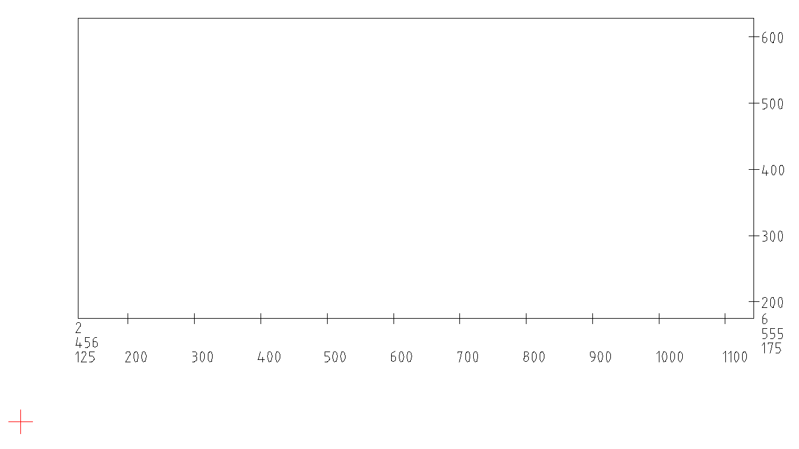

## Installation instructions

1. Install [Python 3](http://www.python.org)
1. Create destination folder for the installation
1. Open command prompt, change into the working folder (created above), and execute the following commands:
	1. `pip install virtualenv`
	1. `virtualenv waiata`
	1. `cd waiata`
	1. `Scripts\activate.bat`
	1. `pip install ezdxf`
	1. `pip install pyyaml`
	1. `git clone https://github.com/novakpetrovic/waiata.git`
	1. `move /Y waiata\*.* .` 
	1. `rmdir /S /Q waiata`
	1. `Scripts\deactivate.bat`
	1. `exit`

## Running instructions

1. Using a plain text editor (e.g. [Notepad++](https://notepad-plus-plus.org/)), edit configuration settings in `1_change_settings_first.yaml`
1. Double click on `2_then_double_click_me.bat` (located in the working folder)
1. Review the dxf drawing generated in the working folder (default name is `3_and_get_your_drawing.dxf`)

## Sample output

